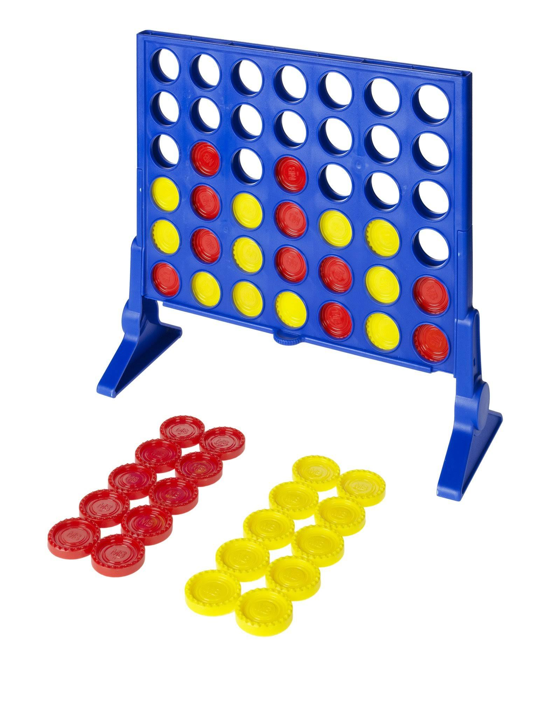

Connect Four
============

Connect Four is an interesting game --- while it is marketed as a kids' game,
it has been studied in game theory and computer science because it is a good
platform for experimenting with computer AIs.

It is a "solved game"; researchers have discovered the *perfect play* for it ---
a mapping of an exact sequence that will win against the best possible defense.
You may find `this short video <https://www.youtube.com/watch?v=yDWPi1pZ0Po>`_
very interesting.

The AI for your Pico's connect four game is written in Python and uses a common
AI algorithm called `Minimax <https://en.wikipedia.org/wiki/Minimax>`_; many
game AIs use this as their foundation. In particular, the AI also uses a
technique called `Alpha-Beta pruning 
<https://en.wikipedia.org/wiki/Alpha–beta_pruning>`_ to avoid exploring paths 
that cannot be possible better/worse than paths already seen.

One of the challenges of writing this AI is that the Pico has relatively limited
memory compared to a real computer --- only about 128 kilobytes are available
for a Python program --- and the minimax algorithm relies on deep recursion
and making new copies of the game board at every step. Therefore, the code for
the AI is well-optimized for performance and minimal memory usage (at the 
expense of some code clarity; the AI functions are overly long and not broken
down, to minimize adding things to the call stack).

Once you're done with everything, I'll show you the code for everything here.
