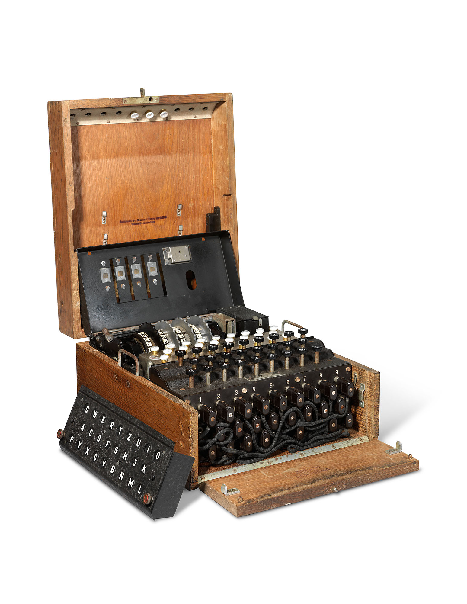

Cryptograms
===========

Here's the program I used to create that cryptogram [`encipher.py`:download:]:

.. literalinclude:: encipher.py

Of course, monoalphabetic substitution cryptograms are not used in the real
world --- as you just demonstrated, they're much too easy to crack.

For several hundred years, though, they did represent the height of cryptography
and were thought to be unbreakable by some. They are the central
plot device in Edgar Allan Poe's short story `The Gold Bug 
<https://poestories.com/read/goldbug>`_.

Despite the publication of that story, resulting in widespread understanding of
how to break these codes, they were used as recently as the
American Civil War, where the Confederates relied of them to encipher military
messages (white supremacists were never very smart).

To learn more about cryptography, including modern, real-world cryptosystems,
here are some places to get started:

- `A friendly video introduction <https://www.youtube.com/watch?v=jhXCTbFnK8o>`_.

- `The Code Book <https://www.barnesandnoble.com/w/code-book-simon-singh/1100169038?ean=9780385495325>`_,
  a delightful introduction to the history and application of cryptography. It's
  very approachable and fun, and parts of it were made into a
  `video series <https://www.amazon.com/Codebreakers-Science-of-Secrecy/dp/B011NM2ICG>`_.

- `The Mathematics of Secrets <https://www.barnesandnoble.com/w/the-mathematics-of-secrets-joshua-holden/1123687855?ean=9780691183312>`_
  is a more technical book, covering the math behind modern cryptosystems.

- For more general security stuff, a friend wrote a book which is
  excellent: `Web Security for Developers <https://nostarch.com/websecurity>`_.
  He also created `Hacksplaining <https://www.hacksplaining.com>`_.
