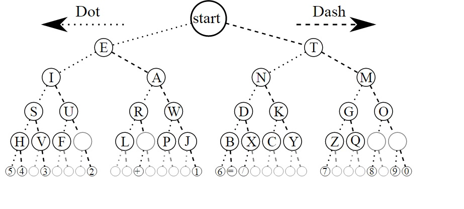

Morse Code
==========

  A cool representation of the code using a binary tree

Congratulations on sending your Morse Code message! :emoji-3x:`😻`!

Obviously, Morse Code is mostly a historical artifact these days, but it was
incredibly influential as widespread example of encoding text in a communicable
format, which lead to the baudot code, ASCII codes, and modern Unicode. It has
an `interesting history <https://www.smithsonianmag.com/innovation/morse-code-celebrates-175-years-and-counting-180972248/>`_.

Two interesting stories about Morse code:

- during the Vietnam War, an American who was captured by the North Vietnamese
  and held in a POW camp was forced to make propaganda videos claiming how he
  had converted to communism and encouraging other Americans to do so. However,
  `Jeremiah Denton <https://en.wikipedia.org/wiki/Jeremiah_Denton>`_ remembered
  Morse code from his military training, and was blinking out the word *TORTURE*
  with his eyelids, and his captors didn't realize that. American intelligence
  officers recognized the code and understood the clue he was sending.

- during World War II, Morse code was a primary means of communication by both
  the Axis and the Allies. Almost all of the messages encoded with the Enigma
  machine were sent via radio Morse code and intercepted by British radio
  dishes. The British could often even tell *which* German radio officer was
  sending a particular message because of subtle patterns in the timing of their
  dots and dashes, providing an important clue to breaking the coded message.

