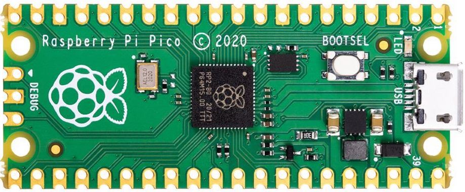

About Your Pico
===============

Your `Pico <https://www.raspberrypi.org/products/raspberry-pi-pico/>`_ is
a tiny microcontroller. Microcontroller are like computers but
without operating systems (and generally, are less powerful, use less power,
and are less expensive). They're useful for interfacing with the real world ---
your keyboard and mouse both have microcontrollers in them, as do most modern
appliances.

It is manufactured by the `Raspberry Pi Foundation 
<https://www.raspberrypi.org>`_, a nonprofit organization
that bridges industrial technological demands with an educational mission.
They're best known for their extremely affordable computers, including one that
is only $5, but can run a full-fledged operating system like Linux. This is
their first entry into the microcontroller space.

The processor that the Pico uses is an "ARM Cortex M0"; ARM chips are a kind of
processor called a "RISC processor", and these have become very popular in the
last decade. Your smartphone uses an ARM processor, and the new Mac M1 chip is
based on an advanced ARM processor.

If you ever need a deep-dive about the Pico and the brand-new RP2040 microchip 
it is based around, there are excellent `datasheets 
<https://www.raspberrypi.org/products/raspberry-pi-pico/specifications/>`_
from the Raspberry Pi Foundation.
