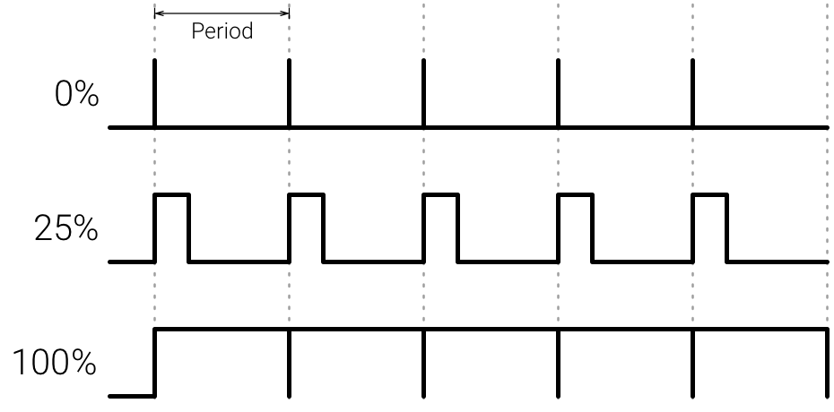

Pulse Width Modulation
======================

Similar to our points about sensors and input, most computers can only output
digital information. However, some things, like the tiny piezoelectric speaker
on your breadboard, want to get different voltages so they vibrate at different
frequencies and therefore play different pitches.

Computers often solve this by something called *pulse width modulation* ---
the computer still only outputs 1 (high) or 0 (low), but it switches back and
forth very quickly between the two states (often thousands of times a second).
To play a higher note, it will stay in the high state a bit longer and therefore
less in the lower state.

This can also be used to show an LED dimmed --- instead of being able to send
different analog outputs, it switches the LED on and off thousands of times
a second, which our eyes perceive as dimmer than fully on.

Some microcontrollers can directly output analog signals, but the Pico isn't
one of these.