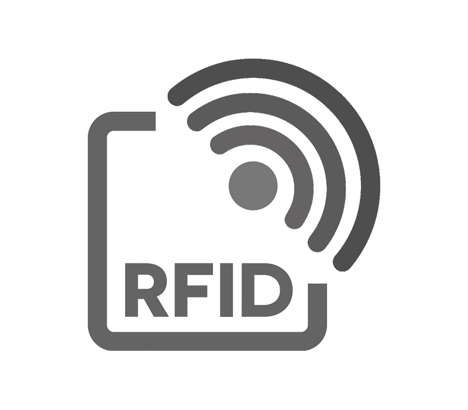

RFID
====

That featureless white card obviously had something inside of it!

It's a card with an RFID chip embedded inside of it. RFID chips do not have
power themselves (there's no tiny battery or anything like that in the card)
and they don't contain things like a magnet. Instead, when your phone (or
another RFID-reading device) sends out a small electromagnetic field, that field
will power the chip enough for it to transmit its data.

Clipper Cards (for those of you in the Bay Area and familiar with our transit
system) use these, as do most other transit systems, security systems, etc.

You can read or write RFID chips using your phone (iPhones are very limited in
the kind of cards they can read or write; Android phones have many more features
for this). RFID is often used for things like inventory management systems,
security passes, conference badges, voting identifiers, and other things. And,
if you believe the tinfoil hat crowd, they're secretly used to track us and
implant evil jet contrails in our brains that space aliens communicate to the
CIA.

You can move on to the next step with::

  >>> import cat
  >>> cat.start()
