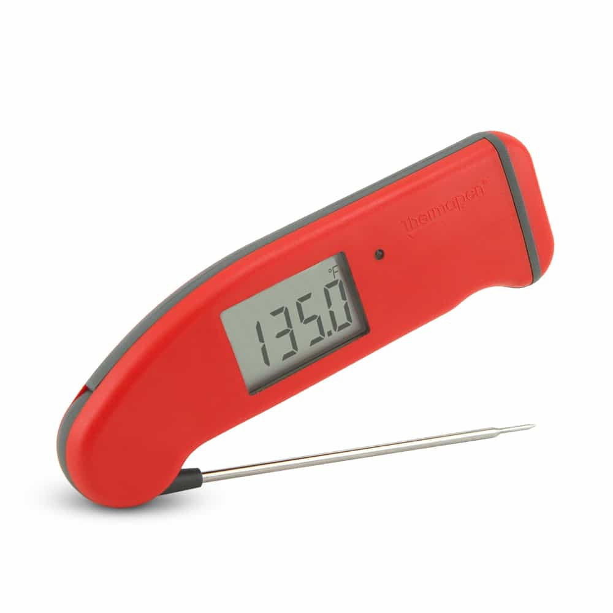

Sensors and Analog Input
========================

One thing microcontrollers are commonly used for are sensing data from the
outside world.

All computer processors, including the Pico, fundamentally operate on binary
data --- everything, in the end, is either a ``1`` or a ``0``. However, your
Pico has several input pins that are *ADC pins* --- analog to digital
converters.

These pins are very sensitive to voltage and can measure how much voltage is
coming in to that pin (it can handle voltage from 0V to +3.3V). The ADC pins
will convert the data to a 16-bit number, ranging from 0 to 65535 (that's
2\ :sup:`16`\ - 1).

Your Pico has a *thermistor*, a sensor that varies the output voltage according
to the temperature, and this can be read and converted to the temperature in
Fahrenheit or Celsius.

The code that just ran looks like this:

.. code-block::

  # Library that provides access to the hardware in MicroPython
  import machine

  # Convert a 16-bit number to 0 - 3.3
  CONVERSION_FACTOR = 3.3 / 65535

  # Define the ADC pin number for the thermistor
  temperature_sensor = machine.ADC(4)

  # read voltage from temp sensor and convert into volts (0 - 3.3V)
  reading = temperature_sensor.read_u16() * CONVERSION_FACTOR

  # convert that to the actual temperature in Celsius:
  # 0.706V is 27 degrees C, with a slope of -1.721mV per degree.
  temperature = 27 - (reading - 0.706) / 0.001721

The blue knob on your breadboard is a *potentiometer*, a device that you turn
to control how much voltage can go through it. That's also a kind of analog
sensor --- it figured out where you had turned it in Connect Four by reading
the voltage passing through and converting it to a Connect Four column from
0 to 7.

There are lots of other sensors that can be connected to microcontrollers to do
all sorts of measurement (I have one that measures moisture in soil, in the
hopes that I finally will stop killing the plants in my kitchen!). Many of these
are very common and inexpensive; there are even `kits like this
<https://www.amazon.com/HiLetgo-Sensors-Assortment-Raspberry-Projects/dp/B01N5910XS/>`_
with lots of sensors bundled together.

The strange looking globe-and-green-board thing in the Ziploc bag is another
kind of sensor and, if you get far enough in our exploration, I'll tell you
more about it.
