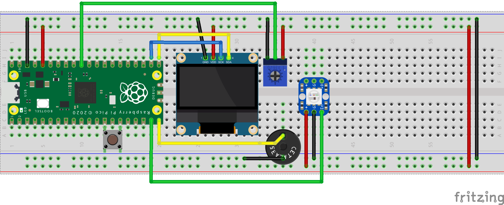

Wiring
======

In case a wire has become loose, here’s how things are connected:

- `Red wires`:red: carry power; `black wires`:black: connect to ground.
  The entire `blue rail`:blue: at each end is connected, so everything
  connecting to that is grounded. Same for the `red rail`:red: and power.

- The Pico provides power/ground to the rails: `ground`:blue: from pin #3,
  and to `power rail`:red: from pin #5.

- The button is connected to `ground`:black: at pin #13 and to pin #15 (which we
  use to determine if the button is pressed or not)

- The speaker (a "piezo", the round black circle) is connected to the `yellow wire`:gold:
  that goes to pin #20 (which is where signal to generate sound are sent), and to `ground`:black: on `blue rail`:blue:.

- The LED (white square on blue board) gets `power`:red: and `ground`:black: from the rails,
  and gets a signal via the `green wire`:green: from pin #19. (This LED is a
  type that can be chained together to make a long series of LEDs; the brand
  for it is a `NeoPixel <https://www.adafruit.com/category/168>`_).

- The screen is connected to `ground`:black: and `power`:red: from the rails,
  and gets the signal of what to display ("SDA") from `yellow wire`:gold: to
  pin #21, and the clock timing ("SCL") from `blue wire`:blue: to pin #22.

- The blue knob (a "potentiometer") is connected to `power`:red:/`ground`:black:
  from the rails, and is read from `green wire`:green: to pin #31.

.. danger:: Don't create a short circuit!

  Do not accidentally connect a `red wire`:red: to the `blue ground rail`:blue:,
  or a `black wire`:black: to the `red power rail`:red:; this can result in a
  short circuit and potentially damage things!
